# Monte Carlo Path Tracer
CG作业 蒙特卡洛路径追踪

## 平台环境
**操作系统：** Win10 x64

**IDE：** VS2017

**依赖：**
- OpenCV (用于绘图)
- yaml-cpp (用于读取模型的一些配置)

## 使用方法
在命令行中输入 "programname.exe model.yaml"

如：

```
MontoCarloPathTracer example.yaml
```
或直接把配置文件拖动到程序文件上。(不知为何，若使用拖动，则配置文件和程序文件需在同一目录，故建议命令行使用)

在解决方案中调试时，需要在项目属性中，调试的参数设置为配置文件地址

## 功能
1. 读取obj文件以及mtl文件渲染场景
1. 实时显示当前渲染结果
1. 具有高光反射、漫反射和折射效果
1. 可以使用场景内部光源（加载model时自动读取），也可以外在添加光源。（程序的示例默认仅使用外部添加光源）
1. 可实时保存迭代出的场景图
1. 命令行会显示模型文件，面片数，分割后的三角面片数，渲染场景大小，以及每次迭代的时间，总时间，平均时间

## 特点
1. 使用配置文件加载模型，不用每次改代码，只需改配置文件即可
1. 使用KDTree对面片搜索进行加速
1. 对光源进行分类，不同光源不同操作
1. 采用单采样而多次迭代，每个像素只采样一条光线（在视点附近），并且进行多次的迭代，与之前的迭代效果进行平均，相当于每个像素进行了多次采样，并且每次迭代都可以看到当前迭代效果


## 注意
本项目包含了一些文件，在已有环境下可以直接调试运行，不需要多余的项目配置

若项目在VS中无法生成，尝试右击项目，重定向项目

另确保环境变量path里包含opencv_world400d.dll及opencv_world400.dll所在目录，或者这两个文件与程序同目录，否则无法运行

## 项目对应数据结构
- Box: 包围盒，定义一个长方体包围场景中的元素，限定所属元素的范围
- MetaClass： 定义一些基类，比如向量，点，颜色，以及一些矩阵操作函数
- Material： 材质类，在加载模型时预先加载材质，包括材质所具有的相应属性
- Triangle： 三角面片，加载模型时会将所有面片分割为三角面片，方便与光线求交
- Face： 面片类，当KDTree搜索到相应面片时，再从中找取相应三角形计算交点
- Model： 模型类，或者是场景类，定义场景中的元素
- Light： 光源类，定义光的位置，大小，方向等，直接光照使用
- Ray： 射线类，也即光线类，包括射线（光线）起点和方向以及当前最大长度
- KDTree： KD树类，用于对模型中的面片建树，加速求光线与面片的求交
- Camera： 相机类，定义视点以及视点方向，相当于标准化眼睛所在位置、方向、角度
- PathTracer： 路径追踪类，对给定的模型进行光线追踪，求出渲染结果
- --
- 此外还有个functions函数文件，用于定义各种其他模型使用到的函数，主要时各个求交函数
- Main文件主要用于程序的启动和展示

## 算法过程
```
for each pixel
	rays = model.getRays(pixel)
	for ray in rays
		sampleColor = trace(ray)
		pixelColor += sampleColor
	end for
	pixelColor /= the size of rays
	
	// for each iterate, the weight of model.color and pixel Color is different
	// newColor = (oldColor * (iter_cnt - 1) + pixelColor) / iter_cnt
	model.color = the mean of model.color and pixelColor
end for
```

```
Color trace(ray)
{
	if the depth of trace > maxDepth
		return BLACK
	color = NULL
	ambientIllumination = Ka of intersection * ambient
	indirectIllumination = NULL
	directIllumination = NULL

	newRay = monteCarloSample(ray)
	indirectIllumination = trace(newRay) * (Kd, Ks or Tf of intersection)

	for each light
		directIllumination += the color from this light
	end for
	
	color  = Ke of intersection + ambientIllumination + indirectIllumination + directIllumination 

	return color
}
```

## 渲染结果图
|Name|iter-1|iter-50|iter-100|
|---|---|---|---|
|Cup|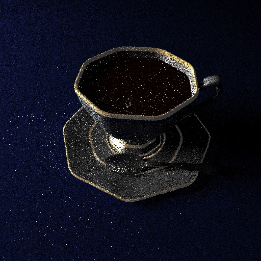|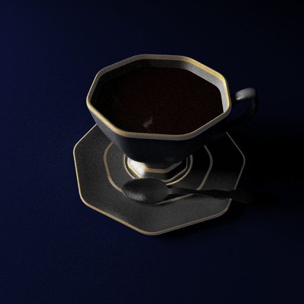||
|Room|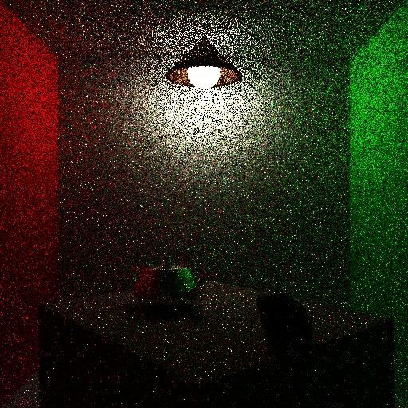||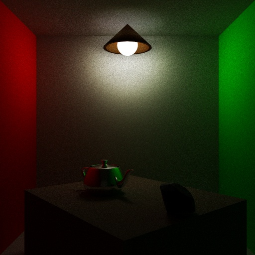|
|VeachMIS|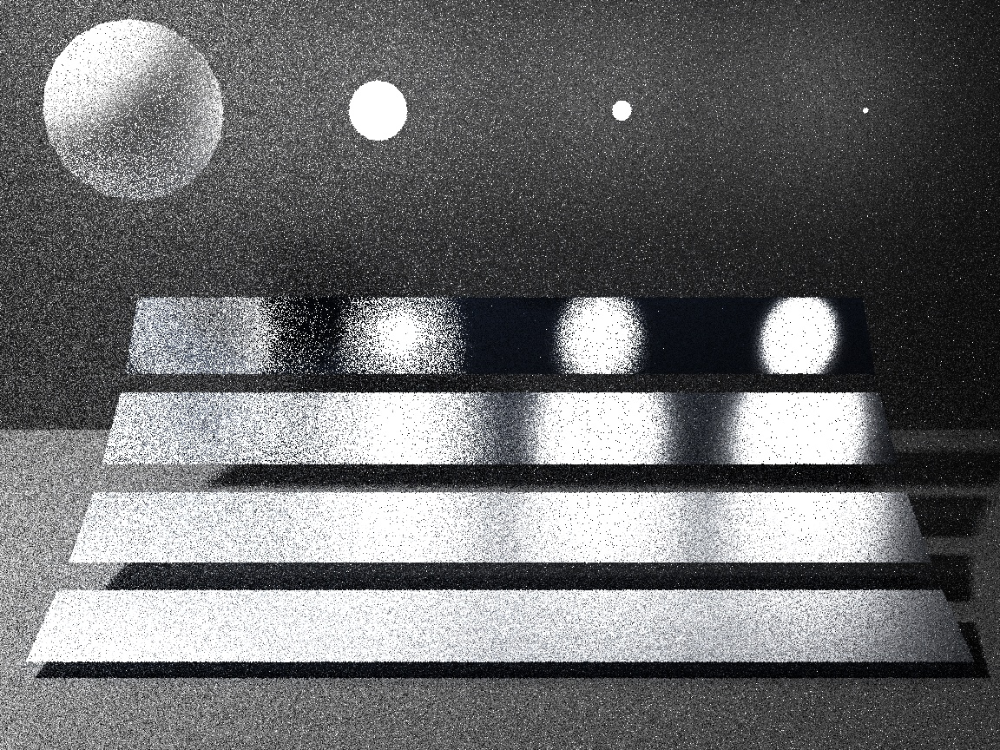|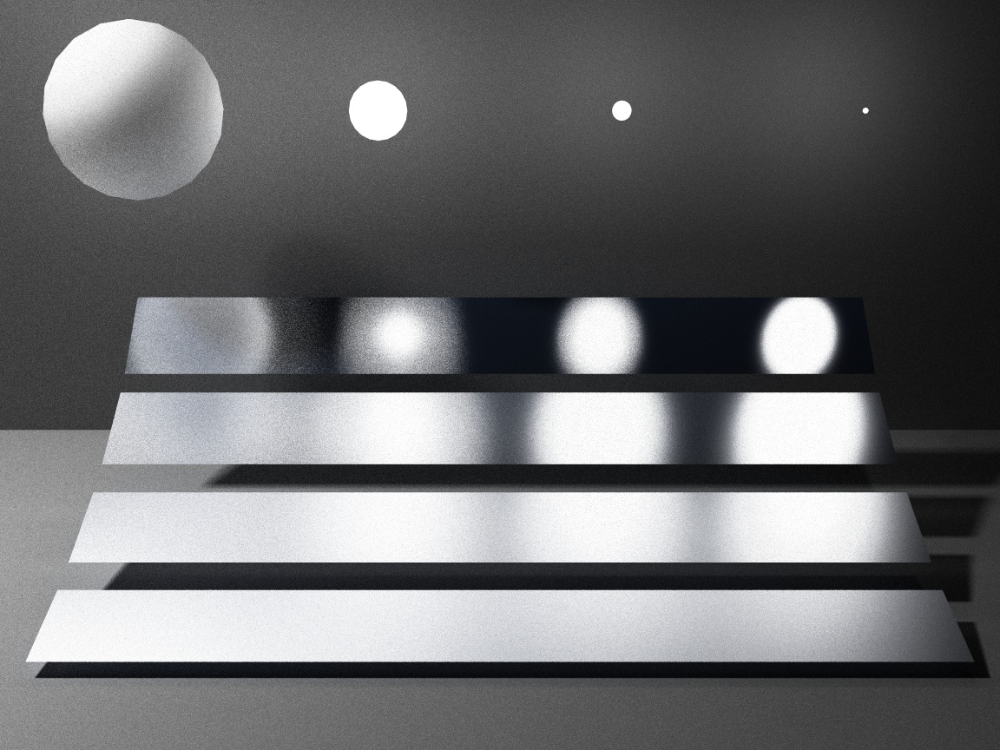|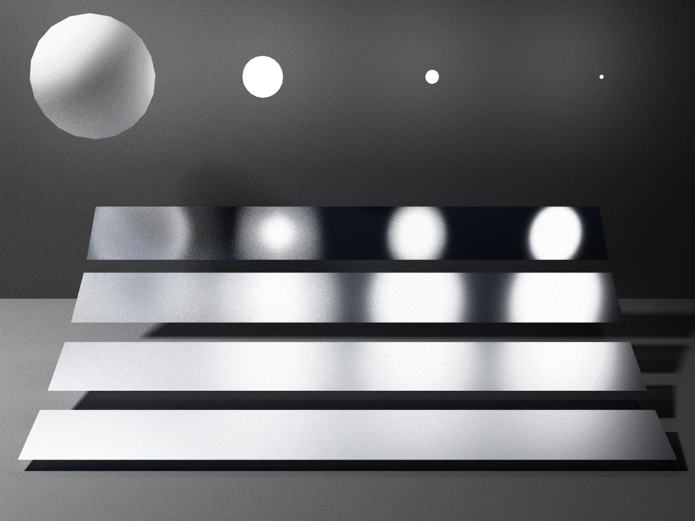|
|Classical|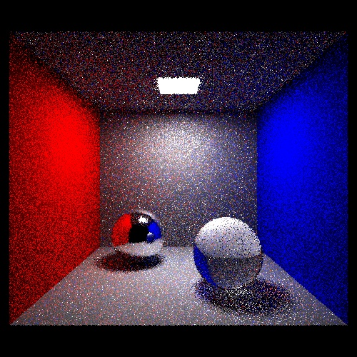|||
|Vase|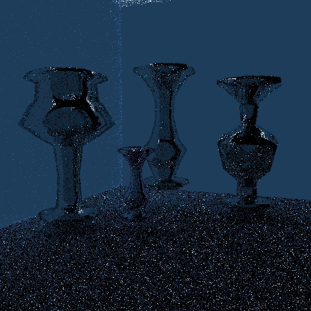|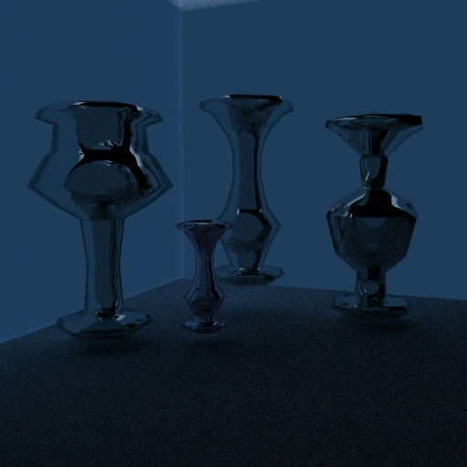|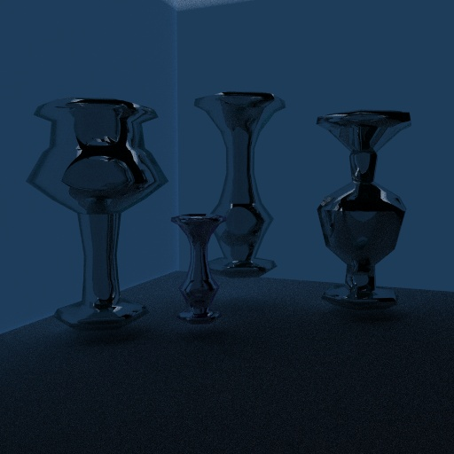|